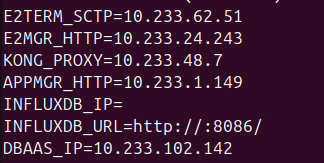
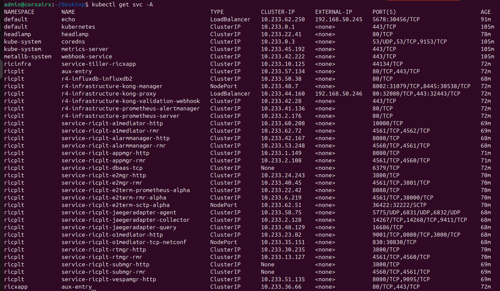

# Near-RT-RIC Lab Deployment

This repository contains helper scripts to deploy **O-RAN SC Near-RT-RIC** in a local lab environment (non-Emulab setup).

The deployment flow automates:

- NGINX setup
- Kubernetes cluster provisioning (via Kubespray)
- Helm configuration
- RIC platform deployment
- Lab-specific networking adjustments

---

## Repository Structure

```md
NEAR-RT-RIC/
├── nginx.sh      # setup nginx service for hosting dashboards (grafana, kubernetes)
├── kubespray.sh  # setup a single node kubspray cluster with calico and metallb
├── kube-extra.sh # extra setups for setting up dashboard and nfs volumes for influxdb
├── fix-dns.sh    # fixes dns/internet disconnection if setup breaks nameserver 
├── get-env.sh    # helper funtion to export import ric-plt ips
└── install_common_templates_to_helm.sh # Modified common templates script to remove root access dependency
```

## Near RT-RIC deployment   

```bash
cd O-RAN/NearRT-RIC
sudo chmod +x *.sh
./nginx.sh
./kuubespray.sh
./kube-extra.sh
git clone (https://gerrit.o-ran-sc.org/r/ric-plt/ric-dep)
cp ./install_common_templates_to_helm.sh ./ric-dep/bin
cd ric-dep/bin
./install_common_templates_to_helm.sh
./install -f ../RECIPE_EXAMPLE/example_recipe_oran_j_release.yaml -c "influxdb jaegeradapter"
./get-env.sh
```




Detailed documentation will be updated at [project page](https://wings-uhm.github.io/Web/2025/10/01/oran/).
