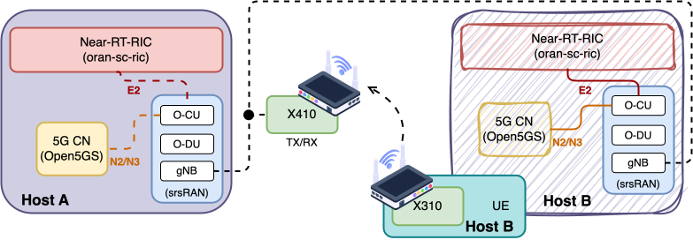
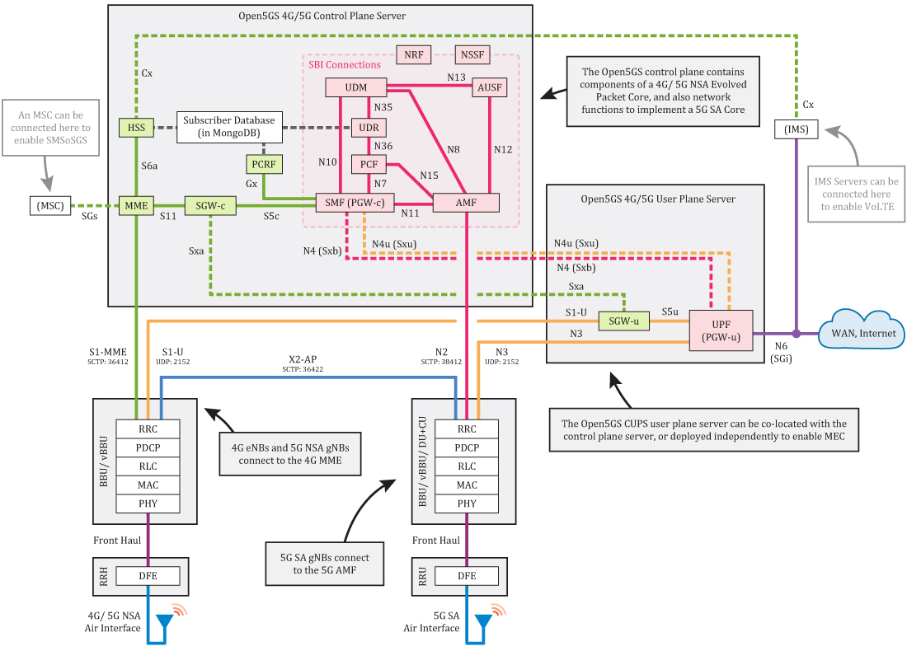
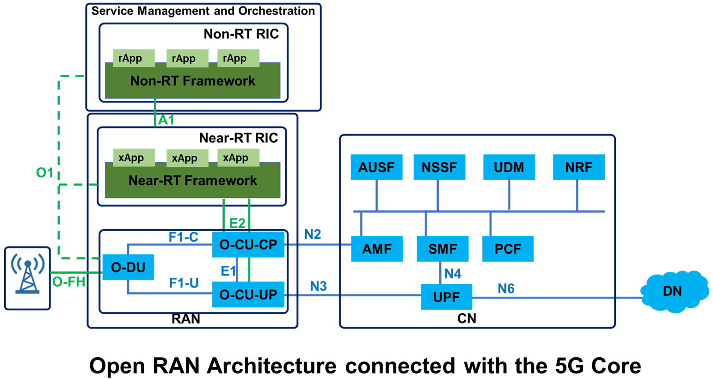

<h1 align="center">O-RAN/AI-RAN Testbed</h1>
<h3 align="center">This Project Display the On-site Open-RAN/AI-RAN Testbed Architecture @ UHM</h3>

---

<h2 align="center">✍️✍️ Authors ✍️✍️</h2>
- Xiaochan Xue (Assistant Professor at UH Manoa)  
- Saurabh Parkar (Ph.D. Student at UH Manoa)  
- Thomas Yang (Master Student at UH Manoa)  
- Aris Carlos (Master Student at UH Manoa)  
- Ethan Morrell (Master Student at UH Manoa)  
- Matthew Matsuo (Master Student at UH Manoa)

<h2 align="center">👇👇 Get Started 👇👇</h2>

  
<strong>Server Specification</strong>

- **CPU**     : AMD Ryzen 9  
- **GPU**     : NVIDIA RTX 5070 Ti  
- **Memory**  : 64GB  
- **Storage** : 2TB SSD  

  
<strong>RF Devices</strong>

- **SDRs**    : X410 (1), X310 (1), N210 (Multiple), clock (1)  
- **iPass**  
- **Antennas** : Horn antenna, omni, directional, RIS  

  
<strong>O-RAN Stack</strong>

1. [Near RT-RIC (i-release)](https://github.com/srsran/oran-sc-ric)
2. [Near RT-RIC (j-release)](https://lf-o-ran-sc.atlassian.net/wiki/spaces/IAT/pages/14516684/Near-RT+RIC+J+Release)
   - Also refer [[Demo](https://zoom.us/rec/play/-crjV6kqiOjdG7zpMyQpj-1xcGV9L08r87hlVSmGhbcaK7KPUGkpkXCHnqdxEe0qzYbt2lKfJT2wX6cP.VjV0IXRtRO90Q7bY?canPlayFromShare=true&from=share_recording_detail&continueMode=true&componentName=rec-play&originRequestUrl=https%3A%2F%2Fzoom.us%2Frec%2Fshare%2FeY2NoHjQE1O4hmKW6dLByTpka6ZJm-QDbtEWu5zHZMg-JzUp30msW2HCZsjGRbFl.q_dm2igKWSBK5LUn), [Deployment Template](https://lf-o-ran-sc.atlassian.net/wiki/spaces/RICP/pages/136839195/RIC+Deployment+Template)] 
3. RAN Stacks
   - [Open5Gs](https://open5gs.org/open5gs/docs/guide/01-quickstart/)
   - [srsRan Project](https://github.com/srsran/srsRAN_project)
   - [OAI 5G Setup](https://hackmd.io/@praveeng/6GMLAB-OAI-5G-SETUP-GUIDE#OAI-5G-SA-Setup-Guide)
   - E2-ORAN Compliant POWDER RAN [[Repo](https://gitlab.flux.utah.edu/powderrenewpublic/srslte-ric), [srslte script](https://gitlab.flux.utah.edu/powder-profiles/oran/-/blob/master/setup-srslte.sh?ref_type=heads)]
4. Some Setup scripts from [POWDER ORAN deployment](https://gitlab.flux.utah.edu/powder-profiles/oran)
5. srsRAN [matlab for furture testings](https://docs.srsran.com/projects/project/en/latest/tutorials/source/matlab/source/index.html)

<h2 align="center">🔗🔗 Architecture 🔗🔗</h2>

  
<strong>Open Radio Access Network (O-RAN)</strong>

  
  

    
  

  ### Setting

  
<strong>5G Core Network (5G CN)</strong>

  

  ### 5G Core Network Components

  Open5GS is an open-source implementation of the 5G Core Network, consisting of the following main components:

  #### Control Plane Components
  - **AMF (Access and Mobility Management Function)** 
    - Responsible for access authentication, mobility management, and connection management of user equipment

  - **SMF (Session Management Function)** 
    - Responsible for establishing, managing, and releasing PDU sessions, as well as UPF selection and control

  - **AUSF (Authentication Server Function)** 
    - Responsible for performing authentication for both 3GPP and non-3GPP access

  - **UDM (Unified Data Management)** 
    - Responsible for generating 3GPP authentication credentials, user identification handling, access authorization, etc.

  - **PCF (Policy Control Function)**
    - Responsible for providing policy rules to control network behavior

  - **NRF (Network Repository Function)** 
    - Supports service discovery functionality, enabling network functions to discover each other

  - **NSSF (Network Slice Selection Function)** 
    - Responsible for selecting appropriate network slice instances

  - **BSF (Binding Support Function)** 
    - Used to support policy and charging control in IP Multimedia Subsystem (IMS) scenarios

  - **CHF (Charging Function)** 
    - Responsible for handling charging and billing functions

  #### User Plane Components
  - **UPF (User Plane Function)** 
    - Responsible for packet routing and forwarding, packet inspection, QoS handling, and other user plane related functions

  #### Other Components
  - **NEF (Network Exposure Function)** 
    - Provides secure APIs for third-party applications to access network functions and information

  - **N3IWF (Non-3GPP Interworking Function)** 
    - Supports connectivity of non-3GPP access (e.g., Wi-Fi) to the 5G core network

 

  
<strong>O-RAN Connection with 5G Core Network</strong>

  
  

  How O-RAN Connects to 5G Core Network？ Including the interfaces, protocols, and ports used for each connection.

  #### Connection Overview

  The O-RAN architecture connects to the 5G Core Network through standardized 3GPP interfaces. The main connection points are:

  1. **Control Plane Connection**: O-CU connects to AMF via N2 interface
  2. **User Plane Connection**: O-CU/O-DU connects to UPF via N3 interface
  3. **Service-Based Interface**: O-CU can interact with other Core Network Functions via SBI

  #### Interface Details and Port Configuration

<h2 align="center">🗓🗓 Milestone 🗓🗓</h2>
