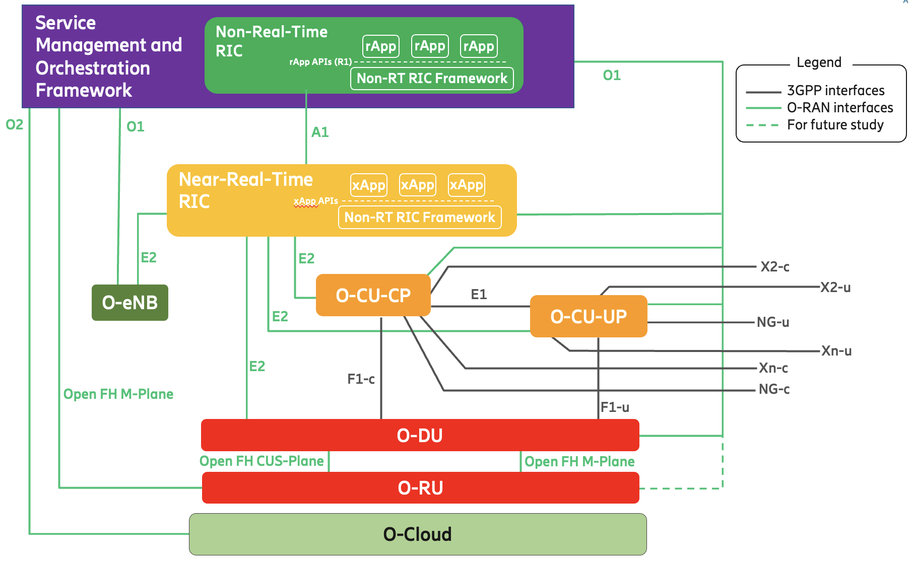

<h1 align="center">O-RAN/AI-RAN Testbed</h1>
<h3 align="center">This Project Display the On-site Open-RAN/AI-RAN Testbed Architecture @ UHM</h3>

---

✍️✍️ **Authors** ✍️✍️ [No ranking]
- Xiaochan Xue (Assistant Professor at UH Manoa)  
- Saurabh Parkar (Ph.D. Student at UH Manoa)  
- Thomas Yang (Master Student at UH Manoa)  
- Aris Carlos (Master Student at UH Manoa)  
- Ethan Morrell (Master Student at UH Manoa)

<h2 align="center">👇👇 Get Started 👇👇</h2>

  
<strong>Server Specification</strong>

- **CPU**     : AMD Ryzen 9  
- **GPU**     : NVIDIA RTX 5070 Ti  
- **Memory**  : 64GB  
- **Storage** : 2TB SSD  

  
<strong>RF Devices</strong>

- **SDRs**    : X410 (1), X310 (1), N210 (Multiple), clock (1)  
- **iPass**  
- **Antennas** : Horn antenna, omni, directional, RIS  

  
<strong>O-RAN Stack</strong>

1. [Near RT-RIC (i-release)](https://github.com/srsran/oran-sc-ric)
2. [Near RT-RIC (j-release)](https://lf-o-ran-sc.atlassian.net/wiki/spaces/IAT/pages/14516684/Near-RT+RIC+J+Release)
   - Also refer [[Demo](https://zoom.us/rec/play/-crjV6kqiOjdG7zpMyQpj-1xcGV9L08r87hlVSmGhbcaK7KPUGkpkXCHnqdxEe0qzYbt2lKfJT2wX6cP.VjV0IXRtRO90Q7bY?canPlayFromShare=true&from=share_recording_detail&continueMode=true&componentName=rec-play&originRequestUrl=https%3A%2F%2Fzoom.us%2Frec%2Fshare%2FeY2NoHjQE1O4hmKW6dLByTpka6ZJm-QDbtEWu5zHZMg-JzUp30msW2HCZsjGRbFl.q_dm2igKWSBK5LUn), [Deployment Template](https://lf-o-ran-sc.atlassian.net/wiki/spaces/RICP/pages/136839195/RIC+Deployment+Template)] 
3. RAN Stacks
   - [Open5Gs](https://open5gs.org/open5gs/docs/guide/01-quickstart/)
   - [srsRan Project](https://github.com/srsran/srsRAN_project)
   - E2-ORAN Compliant POWDER RAN [[Repo](https://gitlab.flux.utah.edu/powderrenewpublic/srslte-ric), [srslte script](https://gitlab.flux.utah.edu/powder-profiles/oran/-/blob/master/setup-srslte.sh?ref_type=heads)]
4. Some Setup scripts from [POWDER ORAN deployment](https://gitlab.flux.utah.edu/powder-profiles/oran)

<h2 align="center">🔗🔗 Architecture 🔗🔗</h2>

  
<strong>Open Radio Access Network (O-RAN)</strong>

  
  
  [Detailed O-RAN Specification](https://specifications.o-ran.org/specifications)

  ### Overview

  O-RAN (Open Radio Access Network) is a disaggregated, open, and intelligent RAN architecture that separates the RAN into three main components:

  - **O-CU (Central Unit)**: Handles higher-layer protocols (RRC, PDCP) and connects to the 5G Core Network
  - **O-DU (Distributed Unit)**: Handles lower-layer protocols (RLC, MAC, PHY) and connects to the O-RU
  - **O-RU (Radio Unit)**: Handles the RF transmission/reception

  ### O-RAN Key Components

  - **Near-RT RIC (Near-Real-Time RAN Intelligent Controller)**
    - Provides real-time optimization and control of RAN elements
    - Located between the RAN and the 5G Core Network

  - **E2 Interface**: Connects Near-RT RIC with O-CU/O-DU (E2SM services)
  - **E1 Interface**: Connects O-CU-CP and O-CU-UP within O-CU
  - **F1 Interface**: Connects O-CU and O-DU

  
<strong>5G Core Network (5G CN)</strong>

  

  ### 5G Core Network Components

  Open5GS is an open-source implementation of the 5G Core Network, consisting of the following main components:

  #### Control Plane Components
  - **AMF (Access and Mobility Management Function)** 
    - Responsible for access authentication, mobility management, and connection management of user equipment

  - **SMF (Session Management Function)** 
    - Responsible for establishing, managing, and releasing PDU sessions, as well as UPF selection and control

  - **AUSF (Authentication Server Function)** 
    - Responsible for performing authentication for both 3GPP and non-3GPP access

  - **UDM (Unified Data Management)** 
    - Responsible for generating 3GPP authentication credentials, user identification handling, access authorization, etc.

  - **PCF (Policy Control Function)**
    - Responsible for providing policy rules to control network behavior

  - **NRF (Network Repository Function)** 
    - Supports service discovery functionality, enabling network functions to discover each other

  - **NSSF (Network Slice Selection Function)** 
    - Responsible for selecting appropriate network slice instances

  - **BSF (Binding Support Function)** 
    - Used to support policy and charging control in IP Multimedia Subsystem (IMS) scenarios

  - **CHF (Charging Function)** 
    - Responsible for handling charging and billing functions

  #### User Plane Components
  - **UPF (User Plane Function)** 
    - Responsible for packet routing and forwarding, packet inspection, QoS handling, and other user plane related functions

  #### Other Components
  - **NEF (Network Exposure Function)** 
    - Provides secure APIs for third-party applications to access network functions and information

  - **N3IWF (Non-3GPP Interworking Function)** 
    - Supports connectivity of non-3GPP access (e.g., Wi-Fi) to the 5G core network

 

  
<strong>O-RAN Connection with 5G Core Network</strong>

  
  

  ### Tutorial: How O-RAN Connects to 5G Core Network

  This section provides a step-by-step guide on how O-RAN components connect to the 5G Core Network (Open5GS), including the interfaces, protocols, and ports used for each connection.

  #### Connection Overview

  The O-RAN architecture connects to the 5G Core Network through standardized 3GPP interfaces. The main connection points are:

  1. **Control Plane Connection**: O-CU connects to AMF via N2 interface
  2. **User Plane Connection**: O-CU/O-DU connects to UPF via N3 interface
  3. **Service-Based Interface**: O-CU can interact with other Core Network Functions via SBI

  #### Interface Details and Port Configuration

  | Connection | From | To | Interface | Protocol | Default Port | Description |
  |-----------|------|----|-----------|----------|--------------|-------------|
  | **Control Plane** | O-CU / gNB | AMF | **N2** | NGAP over SCTP | **38412** | Access and Mobility Management signaling |
  | **User Plane** | O-CU / O-DU | UPF | **N3** | GTP-U over UDP | **2152** | User data packet forwarding |
  | **Session Management** | SMF | UPF | **N4** | PFCP over UDP | **8805** | Session and QoS control |
  | **Service Discovery** | All NFs | NRF | **SBI** | HTTP/2 | **7777** (NRF) | Network function registration and discovery |

  #### Step-by-Step Connection Guide

  **Step 1: Configure 5G Core Network (Open5GS)**

  Before connecting the O-RAN, ensure your Open5GS core network is properly configured:

  1. **Configure AMF** (`amf.yaml`):
     amf:
       ngap:
         - addr: 10.10.0.5        # IP address reachable by O-CU/gNB
           port: 38412            # N2 interface port
       sbi:
         - addr: 127.0.0.5
           port: 7777             # Service-Based Interface port
       guami:
         - plmn_id:
             mcc: 001             # Mobile Country Code
             mnc: 01              # Mobile Network Code
           amf_id:
             region: 2
             set: 1
             region_id: 2
       tai:
         - plmn_id:
             mcc: 001
             mnc: 01
           tac: 1                 # Tracking Area Code
       plmn_support:
         - plmn_id:
             mcc: 001
             mnc: 01
           slice:
             - sst: 1             # Slice/Service Type
               sd: 000001
       2. **Configure UPF** (`upf.yaml`):
     upf:
       gtpu:
         - addr: 10.11.0.7        # IP address for N3 interface (user plane)
       pfcp:
         - addr: 127.0.0.7
           port: 8805             # N4 interface port (PFCP)
       3. **Configure SMF** (`smf.yaml`):ml
     smf:
       pfcp:
         - addr: 127.0.0.4
       gtpc:
         - addr: 127.0.0.4
       sbi:
         - addr: 127.0.0.4
           port: 7777
       upf:
         - addr: 10.11.0.7        # UPF address for N4 interface
       **Step 2: Configure O-RAN O-CU**

  Configure the O-CU to connect to the 5G Core Network:

  1. **Set N2 Interface (Control Plane)**:
     - AMF Address: `10.10.0.5`
     - AMF Port: `38412`
     - Protocol: SCTP
     - Ensure SCTP is enabled and not blocked by firewall

  2. **Set N3 Interface (User Plane)**:
     - UPF Address: `10.11.0.7`
     - UPF Port: `2152`
     - Protocol: GTP-U over UDP

  3. **Configure Network Parameters**:
     - PLMN ID: MCC `001`, MNC `01` (must match AMF configuration)
     - TAC (Tracking Area Code): `1` (must match AMF configuration)
     - Slice NSSAI: SST `1`, SD `000001` (must match AMF configuration)

  **Step 3: Verify Connections**

  1. **Check N2 (Control Plane) Connection**:
     - Start AMF first
     - Start O-CU/gNB
     - Check AMF logs for: `gNB-N2 accepted` or `NG Setup Request received`
     - Check O-CU logs for successful NGAP association

  2. **Check N3 (User Plane) Connection**:
     - After N2 is established, the user plane connection will be set up automatically
     - Monitor UPF logs for GTP-U tunnel establishment
     - Verify that packets can flow through the N3 interface

  3. **Check Service Discovery**:
     - Verify NRF is running and accessible
     - Check that AMF, SMF, and UPF are registered with NRF
     - Use service discovery to verify connectivity between network functions

  **Step 4: Troubleshooting Common Issues**

  - **N2 Connection Fails**:
    - Verify SCTP is enabled: `sudo modprobe sctp`
    - Check firewall rules allow SCTP traffic on port 38412
    - Ensure IP addresses are reachable between O-CU and AMF
    - Verify PLMN, TAC, and NSSAI values match on both sides

  - **N3 Connection Fails**:
    - Verify UDP port 2152 is not blocked
    - Check UPF address is reachable from O-CU/O-DU
    - Ensure GTP-U tunneling is properly configured

  - **Service Discovery Issues**:
    - Verify NRF is running and accessible
    - Check SBI ports (default 7777) are open
    - Ensure HTTP/2 is supported for Service-Based Interfaces

  #### Network Architecture Flow
  UE <--> O-RU <--> O-DU <--> O-CU
                                |
                                | N2 (NGAP/SCTP:38412) → AMF
                                | N3 (GTP-U/UDP:2152) → UPF
                                |
                          5G Core Network
                                |
                    AMF ←→ SMF ←→ UPF
                     |      |      |
                     └──────┴──────┘
                           NRF
                      (Service Discovery)

<h2 align="center">🗓🗓 Milestone 🗓🗓</h2>